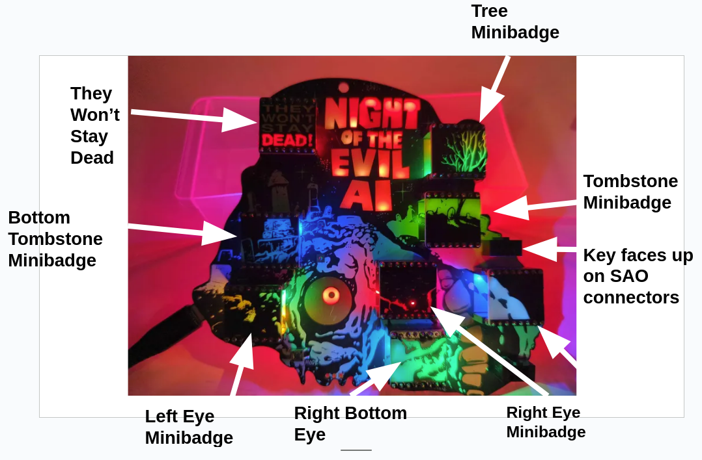

# Night of the Evil AI Minibadge Expansion Board Instructions

For the board itself, solder the minibadge headers and the SAO connectors. The SAO connector key should face up (See image).
This badge runs best with USB power although it will work with batteries. 

I recommend putting hot glue over the LEDs / mask area on the minibadges for better diffusion of light. 

## Components
